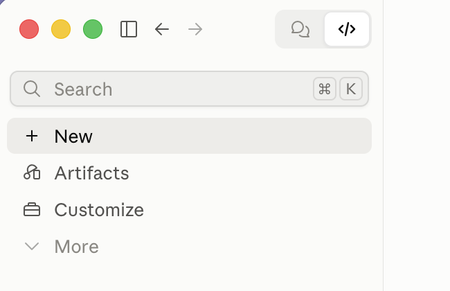
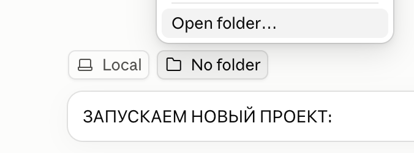

# Genjutsu через fal.ai — готовый проект для Claude Code

Повторяет чужое видео или тренд с тобой вместо исполнителей: из видео берутся движения, мимика, тайминг и камера, из твоих фото — лицо и фигура. Слева и справа — ты в двух образах или два разных человека. На выходе два файла, клип и сравнение «оригинал над результатом», оба открываются в галерее айфона.

<a href="https://www.youtube.com/shorts/CoiIKzihwpU"></a>

Ролик 15 секунд стоит около 5–6 $ на fal.ai. Claude ведёт по шагам, задаёт вопросы по одному и перед каждой тратой называет цену.

**[Подробная инструкция с картинками →](https://<аккаунт>.github.io/<репозиторий>/инструкция.html)**

---

## Запуск в Claude Desktop — без терминала

Нужны Мак, приложение [Claude Desktop](https://claude.ai/download) и подписка Pro, Max, Team или Enterprise.

### Первый раз

**1. Переключись на Code.** Вверху слева, рядом со стрелками, два значка: пузырь — Chat, `</>` — Code. Нажми `</>`.



**2. Выбери папку.** Нажми **+ New**. Над полем ввода две кнопки: проверь, что на первой написано **Local**. Нажми вторую — **No folder** → **Open folder…**. В окне выбора создай пустую папку кнопкой «Новая папка», например `Документы/Genjutsu`, и нажми «Открыть».



**3. Вставь в чат этот текст и отправь.** Кнопка копирования — в правом верхнем углу блока.

```text
Установи проект по ссылке: <ссылка на репозиторий>

1. Скачай все файлы прямо в эту папку, не в подпапку. Если git нет — скачай архив с GitHub и распакуй сюда.
2. Проверь, что есть python3, ffmpeg и yt-dlp. Чего нет — поставь сам или объясни мне простыми словами, что сделать.
3. Создай файл .env из .env.example и открой его в TextEdit, чтобы я вписал ключ fal.ai. Ключ в чат не проси.
4. Когда я напишу «готово», прочитай .claude/skills/genjutsu/SKILL.md и веди меня по нему с шага 0: вопросы по одному.
```

<!-- скриншот: docs/desktop/desktop-3-install.png -->

**4. Впиши ключ.** Claude откроет файл `.env` в TextEdit. Впиши ключ fal.ai сразу после `FAL_KEY=`, сохрани (`Cmd+S`) и напиши в чат «готово». Ключ — на [fal.ai/dashboard/keys](https://fal.ai/dashboard/keys), 10 $ баланса хватит на 1–2 ролика.

<!-- скриншот: docs/desktop/desktop-5-key.png -->

**5. Разрешай команды.** Claude спрашивает разрешение перед каждой командой — жми «разрешить». Деньги тратятся только после твоего «да» в чате.

<!-- скриншот: docs/desktop/desktop-4-permission.png -->

**6. Фото — перетащи в чат.** Когда Claude попросит фото, перетащи их в поле ввода и подпиши: «сырые фото — это я», «референс стиля для левого образа».

<!-- скриншот: docs/desktop/desktop-6-attach.png -->

### Что Claude спросит дальше

Видео и секунды → ты в двух образах или два разных человека → сырые фото, рост и вес → стиль одежды слева и справа (словами или фото-референсом) → кто где и формат для Reels → проба 6 секунд → весь кусок → правки.

Не знаешь, какое видео взять, — начни с проверенного: Quavo & Takeoff — Hotel Lobby (A COLORS SHOW), https://www.youtube.com/watch?v=x9yop0nYR9g, секунды 0:12–0:27.

### В следующий раз

Вкладка Code → **+ New** → **Local** → кнопка с папкой → **Open folder…** → твоя папка `Genjutsu`. Напиши обычными словами «хочу повторить тренд» или команду `/genjutsu`.

Команда появляется только в новом чате после установки: в чате, где шла установка, её ещё нет, и это нормально.

<!-- скриншот: docs/desktop/desktop-9-skill.png -->

### Если что-то не так

| Что случилось | Что делать |
|---|---|
| Claude не понимает, о чём речь | Напиши: «прочитай .claude/skills/genjutsu/SKILL.md и веди меня по нему». Не видит файл — выбрана не та папка: новый чат и папка `Genjutsu`. |
| Открыт режим Chat (значок-пузырь) | Не подходит: там код выполняется в облаке, без твоей папки, ключа и ffmpeg. Только Code с Local. |
| Пишет «ffmpeg: НЕТ», хотя он стоит | Закрой Claude полностью (`Cmd+Q`) и открой снова. Не помогло — в настройках окружения Local (шестерёнка у поля ввода) добавь в `PATH` папку `/opt/homebrew/bin`. |
| Генерация идёт долго | Видео считается 5–16 минут в фоне. Не закрывай приложение и не давай маку уснуть. Ход видно в меню Views → Tasks. |
| Ключ случайно ушёл в чат | Удали его на [fal.ai/dashboard/keys](https://fal.ai/dashboard/keys), создай новый и впиши в `.env`. |

---

## Сколько стоит (сентябрь 2026)

| Что | Цена |
|---|---|
| Образ (портфолио: лицо, рост, вид с четырёх сторон) | ≈ 0.9 $ |
| Переделать один кадр образа | ≈ 0.3 $ |
| Проба 6 секунд | ≈ 1 $ |
| Весь кусок 15 секунд | ≈ 2.5 $ |
| Правка куска 3 секунды | ≈ 0.5 $ |
| **Ролик 15 секунд целиком** | **≈ 5–6 $** |

Фото и образы загружаются в хранилище fal по ссылке, которую не угадать. Если в исходнике чужой трек, Instagram может выключить звук.

---

## Для тех, кто в терминале

```bash
git clone <ссылка на репозиторий> genjutsu-kit && cd genjutsu-kit
brew install ffmpeg yt-dlp          # Python 3.9+ на маке уже есть
cp .env.example .env                # впиши ключ после FAL_KEY=
claude                              # и напиши /genjutsu
```

В другой проект переносится папка `.claude/skills/genjutsu` (и по желанию `tools/`).

### Что внутри

| Путь | Что это |
|---|---|
| `.claude/skills/genjutsu/SKILL.md` | инструкция для Claude: шаги, вопросы, что переиспользовать |
| `.claude/skills/genjutsu/scripts/genjutsu.py` | весь конвейер: `check`, `status`, `fetch`, `avatar`, `scene`, `recast`, `splice`, `finish`, `iphone` |
| `.claude/skills/genjutsu/templates/recast-prompt.md` | промпт на два персонажа с переменными и абзац про руки |
| `tools/to-iphone.sh` | пережать любое видео так, чтобы его приняла галерея айфона |
| `tools/compare.sh` | сравнение «оригинал над результатом» |
| `tools/add-audio.sh` | наложить звук оригинала на результат |
| `tools/contact-sheet.sh` | лист кадров 4×3 и время резов |
| `tools/download.sh` | скачать видео с YouTube / Instagram (yt-dlp) |
| `tools/photo-prep.sh` | HEIC → JPEG и вырезать лицо крупно |
| `инструкция.html` | подробная инструкция для человека, открывается через GitHub Pages |
| `docs/desktop/` | скриншоты Claude Desktop для инструкций |
